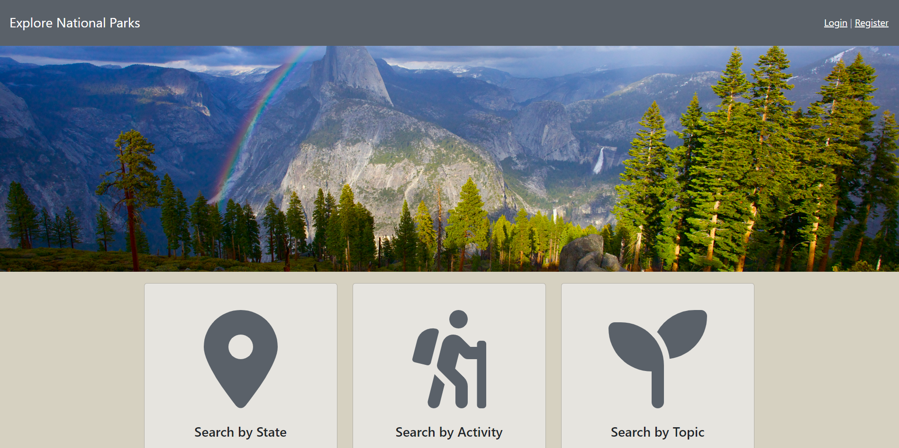
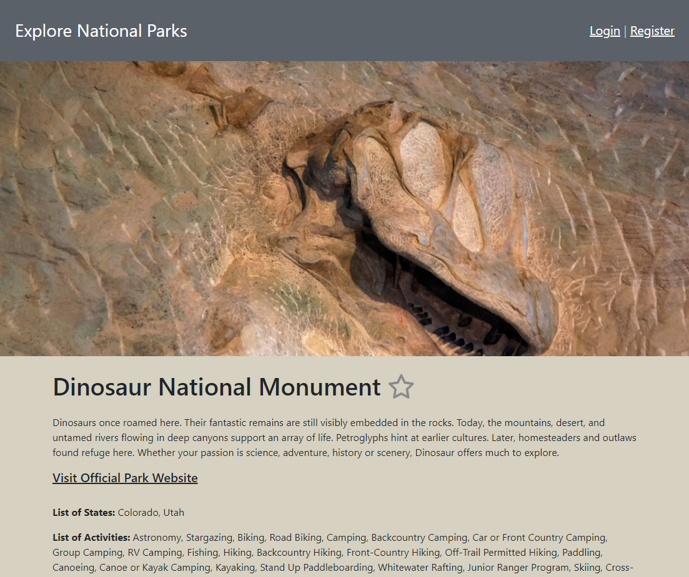
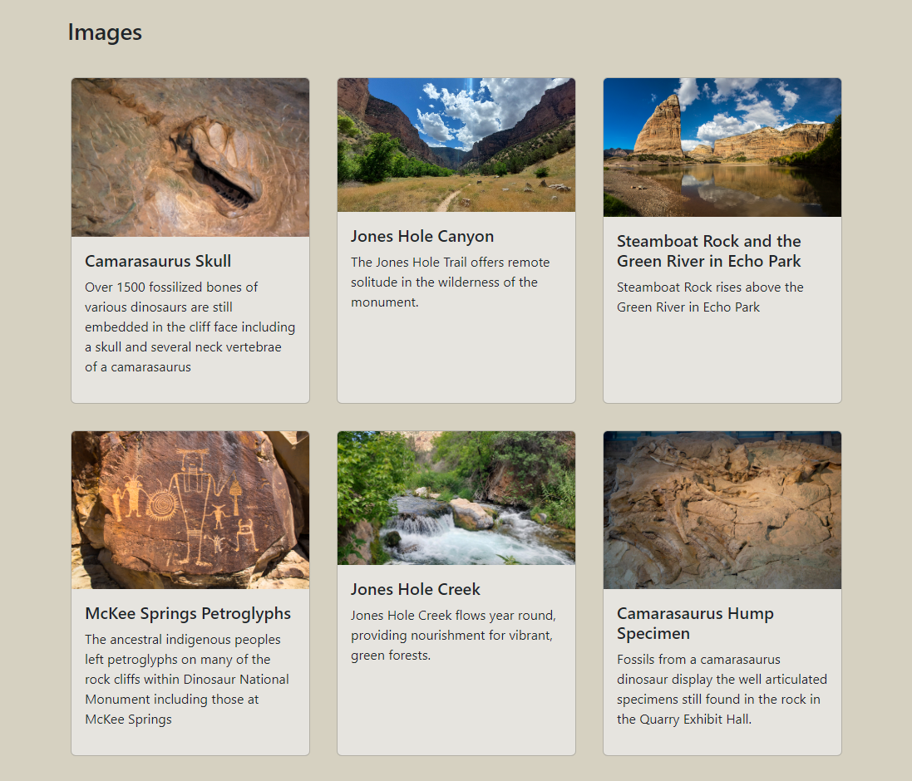

# Explore National Parks
Live site: [https://explore-national-parks.onrender.com/](https://explore-national-parks.onrender.com/)

Demo credentials: email demouser@email.com; password demouserpassword

  <figure>
    
    <figcaption>Image of home page</figcaption>
  </figure>

Explore National Parks is a website where users can search for national parks in the United States via various search criteria, learn more about each park, and keep a list of favorite parks with their own notes about each park. The site makes use of the [National Parks API](https://www.nps.gov/subjects/developer/api-documentation.htm) for all content about the parks.

### Features

The home page of the site features a hero image of Yosemite National Park with a rainbow over the iconic El Capitan. Below that, there are three options available to search for national parks with different filters: state, activity, or topic. Using one of these search features brings you to a page with a short summary about each park in the search result. The user is able to click on any park they'd like to explore futher, which brings them to a page with more details about the park. If the user is registered and logged in, they have the ability to mark the park as a favorite and add notes about the park. Notes can be any text the user chooses and are not be visible to any other user. A park's favorite status is shown with a star next to the park's name and can be toggled on or off whenever information about the park is displayed.

A navigation bar at the top of the page always displays the name of the site "Explore National Parks" on the left (clicking on the name leads to the home page), and on the right either links to register or sign in or an icon representing the user (if the user is signed in) and a link to log out. By clicking on the user icon, a signed-in user can access their profile to change their name or password or view a list of the parks they've favorited. 

The page showing details about a park features a hero image at the top, a description about the park, a link to the official park site, and lists of states, activities, and topics associated with the park. A logged-in user can add or edit notes about the park, which are displayed on the page, and scroll through tiles beautiful images with a short description of each image.

    
    

### Technology Stack

* Back End
    * Python
    * Flask
    * SQLAlchemy ORM with PostgreSQL database
    * WTForms
    * bcrypt for password security
* Front End
    * Jinja2 HTML Templates
    * Bootstrap styling with custom SCSS
    * Some JavaScript, jQuery, and Axios for certain features

### Follow-up Goals
* Implement a general search feature on the nav bar that searches the NPS database using user input
* Refactor app.py to separate out helper functions and/or different features of the website for more concise organization
* Make search results multi-page so the site only has to load 20 results at once
