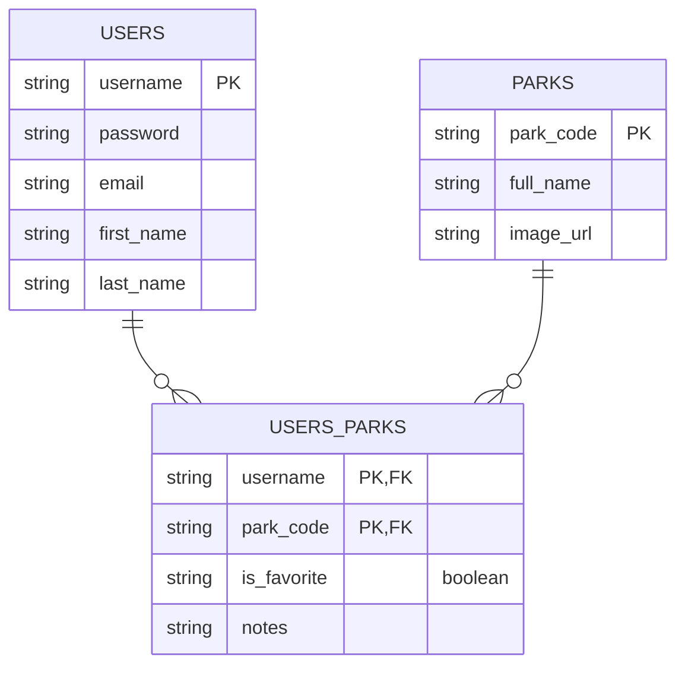

# Capstone One Project Proposal: Explore National Parks

## Overview

Explore National Parks will offer users a chance to browse national parks in the United States in order to plan a trip or learn more about the parks. The site will target anyone who likes to travel, explore the outdoors, or has an interest in nature, history, heritage, or culture. General users will be able to search for parks using various filters/criteria and get more information about any specific park. Additionally, logged-in users can save parks as favorites and add notes to the site about specific parks.

## Content

The site will make use of the [National Parks Service API](https://www.nps.gov/subjects/developer/index.htm) for content regarding the national parks. The API has extensive data which includes essential information about NPS sites such as visitor centers, campgrounds, events, amenities, and activities. The API also has additional resources such as articles, videos, images, and the ability to search for parks by location, amenities, topics, and activities.

## Database Schema

Information on the website will be a balance between data stored in the database and data requested from the API. Some of the data in the database (such as the `PARKS` table as illustrated below) will be prepopulated from the API; other data (such as the `USERS` table) will be collected from registered users and their interactions with the website. Details about the parks (other than that stored in the database) will be requested from the API as needed.

## User Flow

The home page of the site will feature a hero image of a recognizable landmark in a national park with several options available to search for national parks meeting different criteria (location, activities, topics, etc.). Using one of these search features will produce a list of parks. The user will be able to click on any park they'd like to explore futher, which will bring them to a page with more details about the park. If the user is registered and logged in, they will have the ability to mark the park as a favorite and add notes about the park. Notes can be any text the user chooses and will not be visible to any other user.

A navigation bar at the top of the page will always display a link to the home page on the left, and on the right either a link to sign in or an icon representing the user if the user is signed in. By clicking on the user icon, a signed-in user will be able to access their profile to change their name or password, visit a list of the parks they've favorited, or log out. 

## Security

Passwords will be secured by password hashing using the Bcrypt encryption algorithm. Only the hashed version of the password will be stored to ensure greater security. Neither developers nor other users will ever have access to a user's password.

